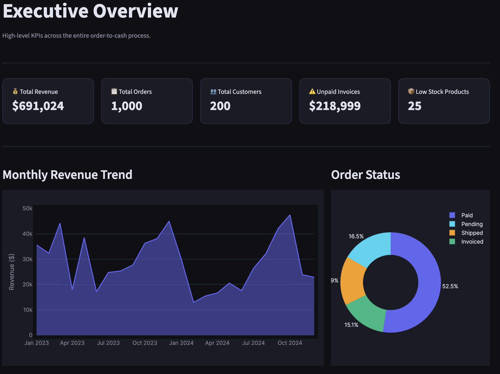
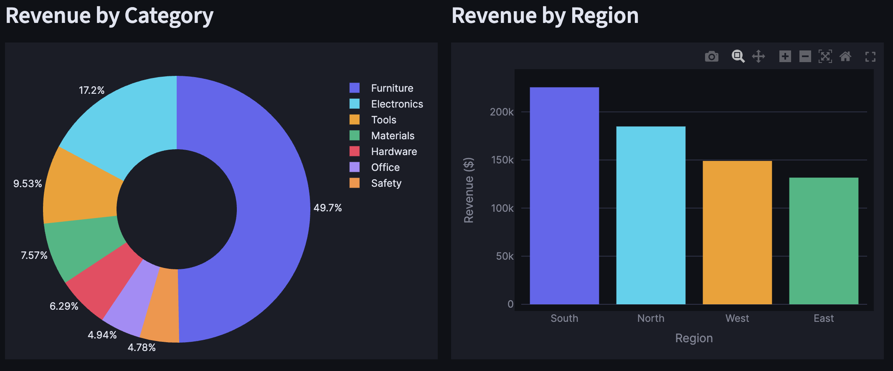
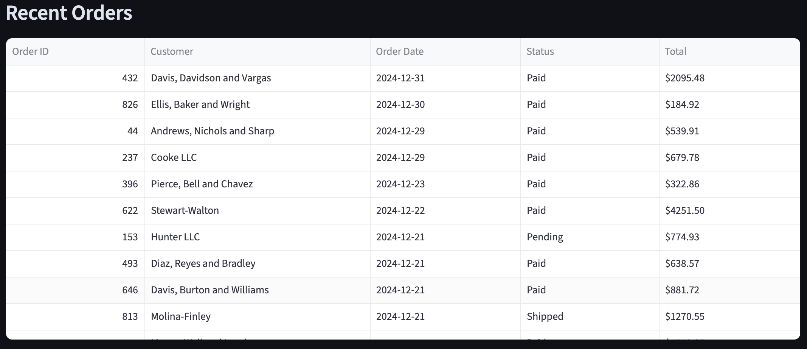
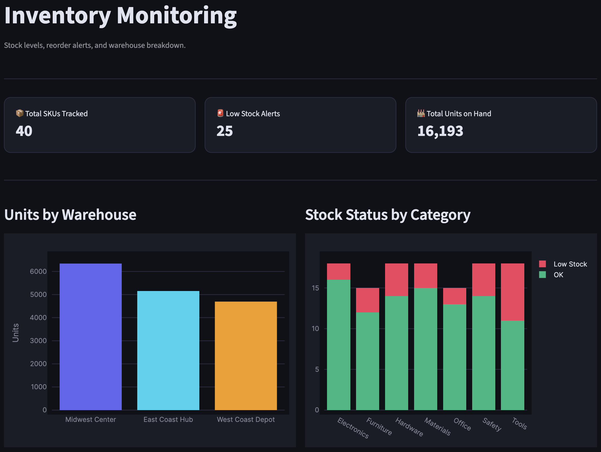
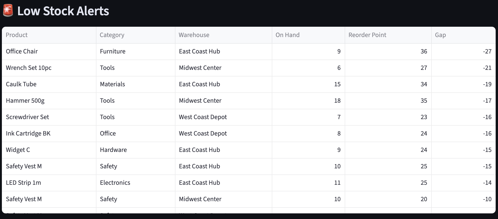

# Mini ERP Order-to-Cash System

I built this project to deepen my understanding of ERP systems. Rather than just reading about how enterprise systems work, I wanted to actually build one, designing the database, modeling the business process, writing the analytics, and visualizing the data end to end.

The order-to-cash process is one of the most fundamental workflows in any ERP system, and understanding how data flows through it, from a customer placing an order to a payment being collected, is something I find interesting. This project gave me hands-on experience with relational database design, SQL analytics, and the kind of business logic that sits behind platforms like SAP and Oracle.

It's part portfolio project, part learning exercise, and part foundation for the work ahead.

---

## Overview

This project models the **order-to-cash (O2C)** business process used in real ERP systems like SAP and Oracle:

```
Customer → Sales Order → Order Items → Inventory Check → Shipment → Invoice → Payment
```

It includes a relational database schema, a realistic synthetic data generator, an ETL pipeline, a star schema analytics layer, SQL analytics queries, reusable reporting views, and a multi-page Streamlit dashboard.

---

## Architecture

```
OLTP tables  →  ETL pipeline  →  Star schema (OLAP)  →  Streamlit dashboard
(schema.sql)    (etl/)            (star_schema.sql)       (streamlit_app.py)
```

The project is structured as a four-layer enterprise analytics stack:

```
┌─────────────────────────────────────────────────────┐
│  Layer 1 · Transactional ERP (OLTP)                 │
│  sql/schema.sql                                     │
│  Tables: customers, products, warehouses,           │
│          inventory, sales_orders, sales_order_items,│
│          shipments, invoices, payments              │
└──────────────────────┬──────────────────────────────┘
                       │ ETL pipeline reads from here
┌──────────────────────▼──────────────────────────────┐
│  Layer 2 · ETL Pipeline                             │
│  etl/build_star_schema.py  — create analytics tables│
│  etl/load_dimensions.py    — populate dim_*  tables │
│  etl/load_facts.py         — populate fact_* tables │
│  etl/etl_utils.py          — shared helpers         │
└──────────────────────┬──────────────────────────────┘
                       │ writes into
┌──────────────────────▼──────────────────────────────┐
│  Layer 3 · Star Schema Analytics (OLAP)             │
│  sql/star_schema.sql                                │
│  Dimensions: dim_customer, dim_product,             │
│              dim_warehouse, dim_date                │
│  Facts:      fact_sales, fact_shipments,            │
│              fact_payments                          │
└──────────────────────┬──────────────────────────────┘
                       │ queried by
┌──────────────────────▼──────────────────────────────┐
│  Layer 4 · Streamlit Dashboard                      │
│  app/streamlit_app.py                               │
│  Key charts read from fact + dim tables;            │
│  operational pages still use OLTP tables directly  │
└─────────────────────────────────────────────────────┘
```

### Why star schema improves reporting

The transactional (OLTP) schema is normalized to reduce data duplication and ensure write integrity, great for recording orders, but requiring many multi-table joins to answer reporting questions like "what was revenue by product category last quarter?"

The star schema is **denormalized for reads**:

- **Fact tables** hold one row per measurable event (one order line, one shipment, one payment) with pre-calculated fields like `extended_amount` and `days_to_pay`.
- **Dimension tables** hold the descriptive context (customer name, product category, calendar quarter) in a single lookup table per subject area.
- **Queries become simpler**: instead of joining 4 OLTP tables, analysts join one fact table to one dimension and get the same answer.
- **Aggregations are faster**: fact tables are wide but shallow — every useful measure is already computed and indexed by date key.

This pattern is how real data warehouses (Snowflake, BigQuery, Redshift) are typically organized, making it the right mental model for enterprise analytics work.

### Modeling tradeoff: surrogate keys

In this project the dimension surrogate keys are set equal to the OLTP source IDs (e.g. `customer_key = customer_id`). This works because the source IDs are stable sequential integers with no reuse.

In a production data warehouse you would decouple the two: the warehouse assigns its own independent integer sequences for dimension keys, completely separate from whatever the source system uses. This protects the analytics layer from source-system changes (renumbering, system migrations, merged source systems) and is required for slowly changing dimension (SCD) patterns where a single source record may need multiple historical rows in the dimension. That decoupling is the right approach for production — the alignment used here is a deliberate simplification for a learning project.

---

## Tech Stack

| Layer | Technology |
|---|---|
| Database | SQLite |
| Schema & Analytics | SQL |
| Data Pipeline | Python, Faker, Pandas |
| Dashboard | Streamlit, Plotly |

---

## Project Structure

```
mini-erp-order-to-cash/
│
├── app/
│   └── streamlit_app.py          # 5-page analytics dashboard
│
├── data/
│   └── erp.db                    # SQLite database (OLTP + star schema)
│
├── docs/
│   ├── er_diagram.png            # Entity relationship diagram
│   ├── workflow_notes.md         # O2C process documentation
│   └── dashboard_screenshots/    # Dashboard screenshots
│
├── etl/                          # ETL pipeline (OLTP → star schema)
│   ├── __init__.py
│   ├── etl_utils.py              # Shared DB connection helpers
│   ├── build_star_schema.py      # Creates star schema tables
│   ├── load_dimensions.py        # Populates dim_* tables
│   └── load_facts.py             # Populates fact_* tables
│
├── scripts/
│   ├── create_database.py        # Builds OLTP tables from schema.sql
│   ├── generate_fake_data.py     # Generates realistic ERP data
│   ├── load_data.py              # Inserts data into erp.db
│   ├── generate_er_diagram.py    # Generates ER diagram PNG
│   └── utils.py                  # Shared helpers
│
├── sql/
│   ├── schema.sql                # OLTP relational schema (9 tables)
│   ├── star_schema.sql           # Star schema DDL (4 dims + 3 facts)
│   ├── views.sql                 # Reporting views
│   ├── analytics_queries.sql     # Business analytics queries
│   └── seed_reference_data.sql   # Reference data
│
├── requirements.txt
├── run_project.py                # Master pipeline orchestration script
└── README.md
```

---

## Database Schema

9 relational tables across 4 dependency layers:

| Table | Description |
|---|---|
| `customers` | Customer master data |
| `products` | Product catalog with cost and price |
| `warehouses` | Warehouse locations |
| `inventory` | Stock levels per product per warehouse |
| `sales_orders` | Order headers linked to customers |
| `sales_order_items` | Line items per order |
| `shipments` | Fulfillment records per order |
| `invoices` | Billing records per order |
| `payments` | Payment records per invoice |

### ER Diagram


---

## Analytics Questions Answered

| Question | Query |
|---|---|
| How much revenue did we make? | Revenue by month |
| Which products sell the most? | Revenue by product |
| Who are the top customers? | Revenue by customer |
| Which invoices are unpaid? | Open invoices |
| Which products are low in stock? | Inventory at risk |
| How fast are we shipping? | Avg days order to shipment |
| How quickly do customers pay? | Avg days invoice to payment |
| What is the order status breakdown? | Order status summary |

---

## SQL Views

| View | Purpose |
|---|---|
| `vw_order_summary` | One row per order with customer info |
| `vw_invoice_payment_status` | Invoice totals, payments, and balance due |
| `vw_inventory_status` | Stock levels with low stock flag |
| `vw_customer_lifetime_value` | Total revenue per customer |

---

## Dashboard

A 5-page Streamlit dashboard built on top of SQL views and analytics queries:

| Page | Contents |
|---|---|
| Executive Overview | KPI cards, revenue trend, order status breakdown |
| Sales Analytics | Top products, top customers, revenue by category and region |
| Order Operations | Fulfillment KPIs, orders by month, recent orders table |
| Invoices & Payments | Invoice status, payment trends, open invoices table |
| Inventory Monitoring | Low stock alerts, units by warehouse, full inventory table |

---

## Dashboard Screenshots

**Executive Overview**


**Sales Analytics**


**Order Operations**


**Invoices & Payments**


**Inventory Monitoring**


---

## How to Run Locally

```bash
# 1. Clone the repo
git clone https://github.com/jringler30/mini-erp-order-to-cash.git
cd mini-erp-order-to-cash

# 2. Install dependencies
pip install -r requirements.txt

# 3. Run the full pipeline (OLTP + ETL + star schema) in one command
python3 run_project.py

# 4. Launch the dashboard
streamlit run app/streamlit_app.py
```

`run_project.py` handles everything in order: creates the OLTP tables, generates and loads fake data, builds the star schema, and populates all dimension and fact tables. You only need to run it once (or again if you want a fresh dataset).

To rebuild just the ETL/analytics layer without regenerating data:
```bash
python3 -m etl.build_star_schema
python3 -m etl.load_dimensions
python3 -m etl.load_facts
```

---

## Data Summary

| Table | Records |
|---|---|
| Customers | 200 |
| Products | 40 |
| Warehouses | 3 |
| Inventory | 120 |
| Sales Orders | 1,000 |
| Order Items | ~3,000 |
| Shipments | ~835 |
| Invoices | ~676 |
| Payments | ~525 |

---

## Warehouse Audit

The star schema was verified against the OLTP source after the ETL ran:

| Check | Result |
|---|---|
| `fact_sales` row count matches `sales_order_items` | 3,011 rows — exact match |
| `fact_shipments` row count matches `shipments` | 835 rows — exact match |
| `fact_payments` row count matches `payments` | 525 rows — exact match |
| Paid revenue — `fact_sales` vs `sales_orders.total_amount` | $691,024.17 — exact match |
| Paid revenue — `fact_sales` vs `sales_order_items` line totals | $691,024.17 — exact match |
| `extended_amount` vs `line_total` per row | 0 mismatches across all 3,011 rows |
| Duplicate rows on natural keys (`order_item_id`, `shipment_id`, `payment_id`) | 0 duplicates |
| NULL `customer_key` or `product_key` in `fact_sales` | 0 orphan rows |
| Date keys in facts missing from `dim_date` | 0 missing keys |
| Negative `days_to_ship` or `days_to_pay` | 0 violations |

---

## Future Improvements

- Decouple dimension surrogate keys from OLTP source IDs; implement SCD Type 2 for customer and product history
- Separate the ETL pipeline from the dashboard startup — run `run_project.py` explicitly rather than auto-building on first Streamlit launch
- Migrate from SQLite to PostgreSQL
- Add role-based user interface
- Simulate returns and refunds
- Add CRM lead-to-order module

---

## Resume Summary

> Built a mini ERP order-to-cash system using SQL, SQLite, Python, and Streamlit to simulate enterprise workflows across sales orders, inventory, shipments, invoices, and payments. Designed a normalized OLTP schema, generated realistic synthetic data, built an ETL pipeline into a star schema analytics layer, and validated the warehouse by reconciling row counts, revenue totals, and key coverage against the source tables. Built a multi-page Streamlit dashboard with key charts reading from the analytics layer.
