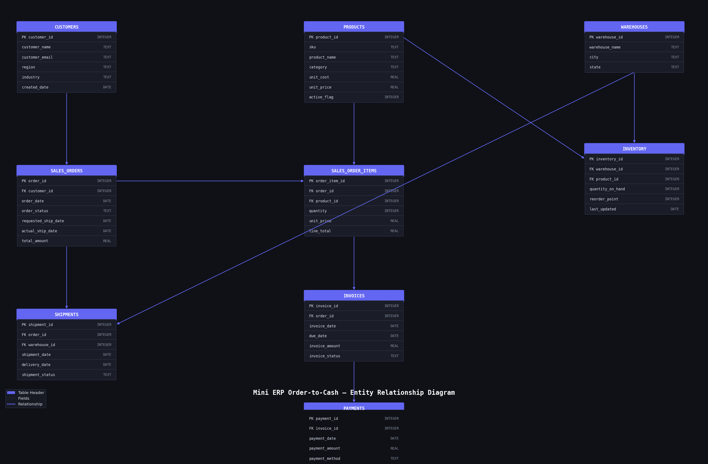

# Mini ERP Order-to-Cash System

A portfolio project that simulates a simplified enterprise ERP workflow — from customer order to final payment — backed by a relational SQLite database and visualized through an interactive analytics dashboard.

---

## Overview

This project models the **order-to-cash (O2C)** business process used in real ERP systems like SAP and Oracle:

```
Customer → Sales Order → Order Items → Inventory Check → Shipment → Invoice → Payment
```

It includes a relational database schema, a realistic synthetic data generator, SQL analytics queries, reusable reporting views, and a multi-page Streamlit dashboard.

---

## Tech Stack

| Layer | Technology |
|---|---|
| Database | SQLite |
| Schema & Analytics | SQL |
| Data Pipeline | Python, Faker, Pandas |
| Dashboard | Streamlit, Plotly |

---

## Project Structure

```
mini-erp-order-to-cash/
│
├── app/
│   └── streamlit_app.py          # 5-page analytics dashboard
│
├── data/
│   ├── erp.db                    # SQLite database
│   └── sample_exports/           # CSV exports (optional)
│
├── docs/
│   ├── er_diagram.png            # Entity relationship diagram
│   ├── workflow_notes.md         # O2C process documentation
│   └── dashboard_screenshots/    # Dashboard screenshots
│
├── scripts/
│   ├── create_database.py        # Builds tables from schema.sql
│   ├── generate_fake_data.py     # Generates realistic ERP data
│   ├── load_data.py              # Inserts data into erp.db
│   ├── generate_er_diagram.py    # Generates ER diagram PNG
│   └── utils.py                  # Shared helpers
│
├── sql/
│   ├── schema.sql                # Full relational schema
│   ├── views.sql                 # Reporting views
│   ├── analytics_queries.sql     # Business analytics queries
│   └── seed_reference_data.sql   # Reference data
│
├── requirements.txt
├── run_project.py
└── README.md
```

---

## Database Schema

9 relational tables across 4 dependency layers:

| Table | Description |
|---|---|
| `customers` | Customer master data |
| `products` | Product catalog with cost and price |
| `warehouses` | Warehouse locations |
| `inventory` | Stock levels per product per warehouse |
| `sales_orders` | Order headers linked to customers |
| `sales_order_items` | Line items per order |
| `shipments` | Fulfillment records per order |
| `invoices` | Billing records per order |
| `payments` | Payment records per invoice |

### ER Diagram



---

## Analytics Questions Answered

| Question | Query |
|---|---|
| How much revenue did we make? | Revenue by month |
| Which products sell the most? | Revenue by product |
| Who are the top customers? | Revenue by customer |
| Which invoices are unpaid? | Open invoices |
| Which products are low in stock? | Inventory at risk |
| How fast are we shipping? | Avg days order to shipment |
| How quickly do customers pay? | Avg days invoice to payment |
| What is the order status breakdown? | Order status summary |

---

## SQL Views

| View | Purpose |
|---|---|
| `vw_order_summary` | One row per order with customer info |
| `vw_invoice_payment_status` | Invoice totals, payments, and balance due |
| `vw_inventory_status` | Stock levels with low stock flag |
| `vw_customer_lifetime_value` | Total revenue per customer |

---

## Dashboard

A 5-page Streamlit dashboard built on top of SQL views and analytics queries:

| Page | Contents |
|---|---|
| Executive Overview | KPI cards, revenue trend, order status breakdown |
| Sales Analytics | Top products, top customers, revenue by category and region |
| Order Operations | Fulfillment KPIs, orders by month, recent orders table |
| Invoices & Payments | Invoice status, payment trends, open invoices table |
| Inventory Monitoring | Low stock alerts, units by warehouse, full inventory table |

---

## How to Run Locally

```bash
# 1. Clone the repo
git clone https://github.com/jringler30/mini-erp-order-to-cash.git
cd mini-erp-order-to-cash

# 2. Install dependencies
pip install -r requirements.txt

# 3. Build the database
python3 scripts/create_database.py

# 4. Generate and load fake data
python3 scripts/load_data.py

# 5. Launch the dashboard
streamlit run app/streamlit_app.py
```

---

## Data Summary

| Table | Records |
|---|---|
| Customers | 200 |
| Products | 40 |
| Warehouses | 3 |
| Inventory | 120 |
| Sales Orders | 1,000 |
| Order Items | ~3,000 |
| Shipments | ~835 |
| Invoices | ~676 |
| Payments | ~525 |

---

## Future Improvements

- Migrate from SQLite to PostgreSQL
- Add role-based user interface
- Simulate returns and refunds
- Add CRM lead-to-order module
- Deploy dashboard to Streamlit Cloud

---

## Resume Summary

> Built a mini ERP order-to-cash system using SQL, SQLite, Python, and Streamlit to simulate enterprise workflows across sales orders, inventory, shipments, invoices, and payments. Designed a relational database schema, generated realistic transactional data, and built an analytics dashboard for revenue, fulfillment, invoicing, and inventory monitoring.
